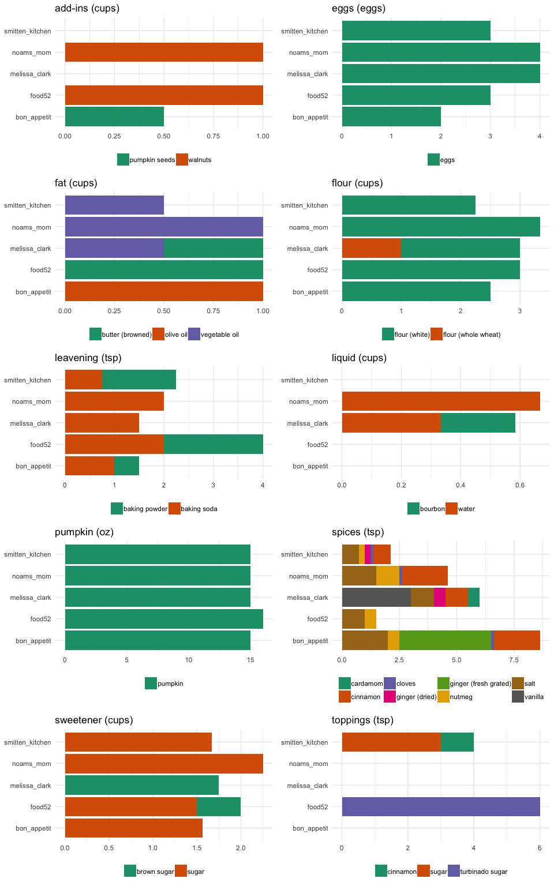

Pumpkin Bread Recipe Variation
================
Noam Ross
2018-11-14

``` r
library(tidyverse)
```

    ## ── Attaching packages ──────────────────────────────────────────────────────────────────────────────────────────────────────────────────────────────────────────────────────────────────────────────────────────────────────────────────────── tidyverse 1.2.1 ──

    ## ✔ ggplot2 3.0.0     ✔ purrr   0.2.5
    ## ✔ tibble  1.4.2     ✔ dplyr   0.7.7
    ## ✔ tidyr   0.8.2     ✔ stringr 1.3.1
    ## ✔ readr   1.1.1     ✔ forcats 0.3.0

    ## ── Conflicts ─────────────────────────────────────────────────────────────────────────────────────────────────────────────────────────────────────────────────────────────────────────────────────────────────────────────────────────── tidyverse_conflicts() ──
    ## ✖ dplyr::filter() masks stats::filter()
    ## ✖ dplyr::lag()    masks stats::lag()

``` r
library(patchwork)
knitr::opts_chunk$set(fig.path = '')
url <- "https://docs.google.com/spreadsheets/d/e/2PACX-1vReilJoGr0hyNEP7u9npNmVkG9jWjOGabz-C2l7svM1f4PE7VXeN-1mQ-uoVdNZx-E1FvPfr_zutCZN/pub?gid=0&single=true&output=csv"
# Sheet link: https://docs.google.com/spreadsheets/d/1gbcQ0PD1TVSKLcPwy_xUPR2YpJkHYbg8DzwO3AQiYwg/edit#gid=0
```

``` r
raw_pumkin <- read_csv(url)
```

    ## Parsed with column specification:
    ## cols(
    ##   category = col_character(),
    ##   ingredient = col_character(),
    ##   units = col_character(),
    ##   noams_mom = col_double(),
    ##   bon_appetit = col_character(),
    ##   smitten_kitchen = col_character(),
    ##   food52 = col_character(),
    ##   melissa_clark = col_character()
    ## )

``` r
pumpkin <- raw_pumkin %>% 
  filter(!category %in% c("url", "method")) %>% 
  gather("source", "quantity", -category, -ingredient, -units) %>% 
  mutate(quantity = coalesce(as.numeric(quantity), 0),
         category = paste0(category, " (", units, ")"))
```

``` r
pplots <- pumpkin %>% 
  split(pumpkin$category) %>% 
  map(function(x) {
    ggplot(x, aes(x = source, y = quantity, fill = ingredient)) +
      geom_col() +
      coord_flip() +
      theme_minimal() +
      scale_fill_brewer(palette="Dark2") +
      theme(legend.position = "bottom", legend.title = element_blank(),
            axis.title = element_blank()) +
      labs(title = x$category[1])
  })
```

``` r
wrap_plots(pplots, ncol = 2)
```

<!-- -->
